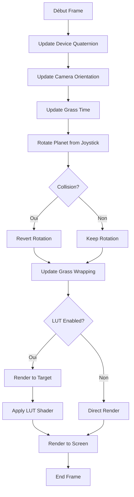

# Système 3D Complet - Planète Interactive

## Vue d'ensemble du projet

Application AR/3D React Native avec Expo qui crée une expérience immersive de planète interactive avec :
- 🌍 Planète sphérique avec grille latitude/longitude
- 🌱 Système d'herbe procédurale avec animation de vent
- 🌌 Atmosphère avec skybox et color grading LUT
- 🎮 Contrôles gyroscope + joystick
- 🎯 Placement interactif de rectangles par tap
- 💥 Système de collision

## Architecture globale

```
AR-T/
├── app/(tabs)/
│   ├── scene3d.tsx          # Scène principale
│   └── grass.tsx            # Scène de test herbe (référence)
├── components/
│   ├── Atmosphere.tsx       # Système d'atmosphère
│   ├── AtmosphereControls.tsx # UI de contrôle (optionnel)
│   ├── Joystick.tsx         # Contrôle joystick
│   └── ResetButton.tsx      # Bouton recentrage
├── hooks/
│   ├── useDeviceMotion.ts   # Hook capteurs gyroscope
│   └── useTapDetector.ts    # Hook détection tap
├── utils/
│   ├── quaternion.ts        # Math quaternions
│   ├── sceneObjects.ts      # Création objets 3D
│   ├── sceneHelpers.ts      # Logique scène (rotation, collision)
│   ├── grassShader.ts       # Shader herbe
│   ├── grassHelpers.ts      # Logique wrapping herbe
│   └── atmosphereHelpers.ts # Helpers atmosphère
├── assets/textures/
│   ├── puresky.png          # Texture ciel
│   ├── lut_test_night2.png  # LUT color grading
│   ├── grass_diffuse.jpg    # Texture herbe (grass.tsx)
│   └── normal_map.jpg       # Normal map (grass.tsx)
└── docs/
    ├── GRASS_SYSTEM.md      # Doc système herbe
    └── ATMOSPHERE_SYSTEM.md # Doc système atmosphère
```

## Systèmes intégrés

### 1. Planète & Navigation
- **Planète sphérique** (rayon 50) centrée en (0, -50, 0)
- **Grille** de latitude/longitude (40 segments)
- **Rotation** basée sur joystick + orientation caméra
- **Gyroscope** pour contrôle caméra immersif

### 2. Herbe procédurale
- **32,000 brins** d'herbe (8×8 tiles × 500 instances)
- **Shader GLSL** avec animation de vent
- **Wrapping infini** synchronisé avec rotation planète
- **Courbure sphérique** automatique

### 3. Atmosphère & Post-processing
- **Skybox texturé** (sphère rayon 100)
- **LUT color grading** pour ambiance visuelle
- **Render target** pour post-processing GPU
- **Intensité ajustable** (0-1)

### 4. Rectangles interactifs
- **Placement par tap** sur surface planète
- **20 rectangles aléatoires** au démarrage
- **Collision detection** avec caméra
- **Orientation** perpendiculaire à la surface

### 5. Contrôles
- **DeviceMotion** - Gyroscope pour rotation caméra
- **Joystick** - Contrôle rotation planète
- **Tap** - Placement rectangles
- **Reset button** - Recentrage vue

## Flow de rendu



## Utilisation

### Démarrage basique

```bash
npm install
npx expo start
```

### Configuration minimale

```typescript
// Dans scene3d.tsx
const planet = createPlanet();
addGridLinesToPlanet(planet);
scene.add(planet);

const grassData = createGrassGrid();
scene.add(grassData.group);

const atmosphereData = createAtmosphereMeshes(scene, width, height);

// Dans render loop
updateGrassTime(grassMaterial, time);
updateGrassWrapping(grassGroup, planet, prevRot, params);
renderWithAtmosphere(renderer, scene, camera, atmosphereData, gl);
```

### Personnalisation

#### Changer couleur herbe
```typescript
const grassData = createGrassGrid({
  // ... autres params
});
grassData.material.uniforms.uGrassColor.value = new THREE.Vector3(1.0, 0.5, 0.2);
```

#### Ajuster atmosphère
```typescript
updateAtmosphereIntensity(atmosphereDataRef.current, 0.5);
toggleAtmosphereLUT(atmosphereDataRef.current, false);
```

#### Modifier densité herbe
```typescript
const grassData = createGrassGrid({
  instancesPerTile: 1000, // Plus dense
  minHeight: 0.3,
  maxHeight: 0.8,
});
```

## Performance

### Optimisations appliquées

- ✅ **InstancedMesh** pour l'herbe (32k brins en 1 draw call)
- ✅ **Shaders GPU** pour animations et post-processing
- ✅ **Wrapping intelligent** (pas de recréation de mesh)
- ✅ **Frustum culling** automatique par Three.js
- ✅ **RenderTarget** réutilisé chaque frame

### Metrics typiques (iPhone moderne)

- **FPS** : 60 stable
- **Draw calls** : ~70
- **Triangles** : ~100k
- **Frame time** : ~13ms

## Debugging

### Activer les contrôles d'atmosphère

```typescript
import AtmosphereControls from '../../components/AtmosphereControls';

// Dans scene3d.tsx
const [atmIntensity, setAtmIntensity] = useState(0.8);
const [lutEnabled, setLutEnabled] = useState(true);

return (
  <View>
    {/* ... GLView ... */}
    <AtmosphereControls
      intensity={atmIntensity}
      lutEnabled={lutEnabled}
      onIntensityChange={(v) => {
        setAtmIntensity(v);
        updateAtmosphereIntensity(atmosphereDataRef.current, v);
      }}
      onToggleLUT={() => {
        setLutEnabled(!lutEnabled);
        toggleAtmosphereLUT(atmosphereDataRef.current, !lutEnabled);
      }}
    />
  </View>
);
```

### Désactiver des systèmes

```typescript
// Sans herbe
// const grassData = createGrassGrid(...);

// Sans atmosphère LUT
const atmosphereData = createAtmosphereMeshes(scene, width, height, {
  enableLUT: false,
});

// Sans rectangles
// const rectangles = createRandomRectangles(20);
```

## Extensions possibles

### Court terme
- [ ] Variation de couleur herbe par zones
- [ ] Effets de particules (poussière, étoiles)
- [ ] Sons ambients
- [ ] Haptic feedback sur collision

### Long terme
- [ ] Multi-textures pour la planète
- [ ] Système jour/nuit avec transition LUT
- [ ] Océans/lacs avec water shader
- [ ] Arbres et végétation 3D
- [ ] Multiplayer (positions rectangles partagées)

## Documentation détaillée

Voir les docs spécifiques :
- [Système d'herbe](./GRASS_SYSTEM.md)
- [Système d'atmosphère](./ATMOSPHERE_SYSTEM.md)

## Crédits

- **Three.js** - Moteur 3D
- **Expo** - Framework React Native
- **expo-three** - Bridge Three.js pour Expo
- **expo-gl** - WebGL context pour Expo
